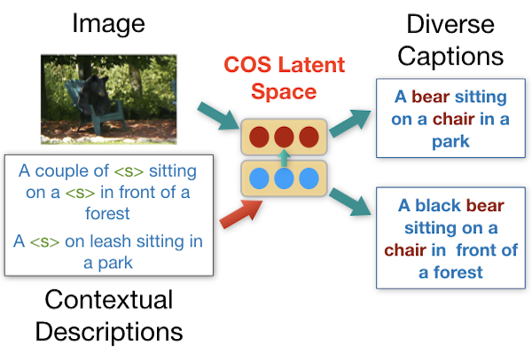

# Diverse Image Captioning with Context-Object Split Latent Spaces

<p align="center">
  
</p>

This repository is the official implementation of **Diverse Image Captioning with Context-Object Split Latent Spaces**.
We additionally include evaluation code from [Luo et al.](https://github.com/ruotianluo/GoogleConceptualCaptioning) in the folder ```GoogleConceptualCaptioning ```, which has been patched for compatibility.


## Requirements
The following code is written in Python 3.6.10 and CUDA 9.0.

Requirements:
- torch 1.1.0
- torchvision 0.3.0
- nltk 3.5
- inflect 4.1.0
- tqdm 4.46.0
- sklearn 0.0
- h5py 2.10.0

To install requirements:

```setup
conda config --add channels pytorch
conda config --add channels anaconda
conda config --add channels conda-forge
conda config --add channels conda-forge/label/cf202003
conda create -n <environment_name> --file requirements.txt
conda activate <environment_name>
```

## Preprocessed data

The dataset used in this project for assessing accuracy and diversity is COCO 2014 (m-RNN split). The full dataset is available [here](http://cocodataset.org/#download).

We use the Faster R-CNN features for images similar to [Anderson et al.](https://github.com/peteanderson80/bottom-up-attention). We additionally require "classes"/"scores" fields detected for image regions. The classes correspond to [Visual Genome](https://visualgenome.org/api/v0/api_home.html).

### Download instructions

Preprocessed training data is available [here](https://drive.google.com/drive/folders/11CK4hxf2UIJQ-QawPrgZC_veE9u6z3cr?usp=sharing) as hdf5 files. The provided hdf5 files contain the following fields:
- image_id: ID of the COCO image
- num_boxes: The proposal regions detected from Faster R-CNN
- features: ResNet-101 features of the extracted regions
- classes: Visual genome classes of the extracted regions
- scores:  Scores of the Visual genome classes of the extracted regions

Note that the ["image_id","num_boxes","features"] fields are identical to Anderson et al.

Create a folder named ```coco ``` and download the preprocessed training and test datasets from the coco folder in the drive link above as follows (it is also possible to directly download the entire coco folder from the drive link):

1. Download the following files for training on COCO 2014 (m-RNN split):
```
coco/coco_train_2014_adaptive_withclasses.h5
coco/coco_val_2014_adaptive_withclasses.h5
coco/coco_val_mRNN.txt
coco/coco_test_mRNN.txt
```

2. Download the following files for training on held-out COCO (novel object captioning):
```
coco/coco_train_2014_noc_adaptive_withclasses.h5
coco/coco_train_extra_2014_noc_adaptive_withclasses.h5
```

3. Download the following files for testing on held-out COCO (novel object captioning):
```
coco/coco_test_2014_noc_adaptive_withclasses.h5
```

4. Download the (caption) annotation files and place them in a subdirectory *coco/annotations* (mirroring the Google drive folder structure)
```
coco/annotations/captions_train2014.json
coco/annotations/captions_val2014.json
```

5. Download the following files from the drive link in a seperate folder *data* (outside coco). These files contain the contextual neighbours for pseudo supervision:
```
data/nn_final.pkl
data/nn_noc.pkl
```

For running the train/test scripts (described in the following) "pathToData"/"nn_dict_path" in params.json and params_noc.json needs to be set to the *coco*/*data* folder created above.

### Verify Folder Structure after Download
The folder structure of ```coco ``` after data download should be as follows,
```
coco
 - annotations
   - captions_train2014.json
   - captions_val2014.json
 - coco_val_mRNN.txt
 - coco_test_mRNN.txt
 - coco_train_2014_adaptive_withclasses.h5
 - coco_val_2014_adaptive_withclasses.h5
 - coco_train_2014_noc_adaptive_withclasses.h5
 - coco_train_extra_2014_noc_adaptive_withclasses.h5
 - coco_test_2014_noc_adaptive_withclasses.h5
data
 - coco_classname.txt
 - visual_genome_classes.txt
 - vocab_coco_full.pkl
 - nn_final.pkl
 - nn_noc.pkl
 ```


## Training
Please follow the following instructions for training:
1. Set hyperparameters for training in params.json and params_noc.json.
2. Train a model on COCO 2014 for captioning,
 ```
		python ./scripts/train.py
 ```
3. Train a model for diverse novel object captioning,
 ```
		python ./scripts/train_noc.py
 ```

Please note that the  ```data ``` folder provides the required vocabulary.

### Memory requirements
The models were trained on a single nvidia V100 GPU with 32 GB memory. 16 GB is sufficient for training a single run.

## Pre-trained models and evaluation
We provide pre-trained models for both captioning on COCO 2014 (mRNN split) and novel object captioning. Please follow the following steps:

1. Download the pre-trained models from [here](https://drive.google.com/drive/folders/1rASJIDyD3XaF7_PGifWf3612Br-L7ezw?usp=sharing) to the  ```ckpts ``` folder.

2. For evaluation of oracle scores and diversity, we follow [Luo et al.](https://github.com/ruotianluo/GoogleConceptualCaptioning). In the folder  ```GoogleConceptualCaptioning ``` download the [cider](https://github.com/ruotianluo/cider) and in the [cococaption](https://github.com/ruotianluo/coco-caption) folder run the download scripts,
 ```
		./GoogleConceptualCaptioning/cococaption/get_google_word2vec_model.sh
		./GoogleConceptualCaptioning/cococaption/get_stanford_models.sh
		python ./scripts/eval.py
 ```

3. For diversity evaluation create the required numpy file for consensus re-ranking using,
 ```
		python ./scripts/eval_diversity.py
 ```
For consensus re-ranking follow the steps [here](https://github.com/mjhucla/mRNN-CR). To obtain the final diversity scores, follow the instructions of [DiversityMetrics](https://github.com/qingzwang/DiversityMetrics). Convert the numpy file to required json format and run the script  ```evalscripts.py ```


4. To evaluate the F1 score for novel object captioning,
 ```
		python ./scripts/eval_noc.py
 ```

## Results

### Oracle evaluation on the COCO dataset

|          |   B4 	|   B3   |   B2   |   B1   |  CIDEr | METEOR | ROUGE | SPICE |
| -------- | ------ | ------ | ------ | ------ | ------ | ------ | ------|------ |
| COS-CVAE | 0.633  | 0.739  | 0.842  | 0.942  | 1.893  | 0.450  | 0.770 | 0.339 |


### Diversity evaluation on the COCO dataset

|          | Unique |  Novel |  mBLEU |  Div-1 |  Div-2 |
| -------- | ------ | ------ | ------ | ------ | ------ |
| COS-CVAE |  96.3  |  4404  |  0.53  |  0.39  |  0.57  |


### F1-score evaluation on the held-out COCO dataset
|          | bottle |  bus   |  couch | microwave | pizza  | racket | suitcase | zebra | average |
| -------- | ------ | ------ | ------ | --------- | ------ | ------ |  ------  | ------| ------  |
| COS-CVAE |  35.4  |  83.6  |  53.8  |   63.2    |  86.7  |  69.5  |   46.1   |  81.7 |   65.0  |